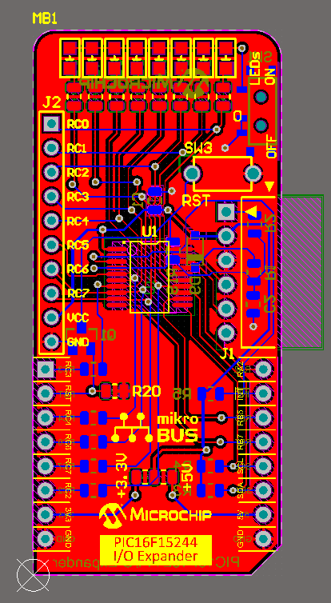
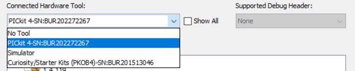

# IO Expander Demo PCB Assembly and Demo

This set of instructions is for building a demo version of the Advanced I/O Expander in an easy-to-use MikroBus&trade; form factor.

## Table of Contents

* [Development Tools](#development-tools)
* [Device Overview](#device-overview)
* [Assembly](#assembly)
  * [Soldering Difficulty](#soldering-difficulty)
  * [Bill of Materials (BOM)](#bill-of-materials--bom-)
  * [Order of Assembly](#order-of-assembly)
  * [Programming](#programming)
* [Demo Program](#demo-program)
* [Description](#description)

## Development Tools

- [MPLAB&reg; PICKIT&trade; 4 (PG164140)](https://www.microchip.com/en-us/development-tool/PG164140?utm_source=GitHub&utm_medium=TextLink&utm_campaign=MCU8_MMTCha_pic152xx&utm_content=pic16f15244-advanced-io-expander-github)
- [Curiosity Development Board, Rev 4 (DM164137)](https://www.microchip.com/DevelopmentTools/ProductDetails/PartNO/DM164137?utm_source=GitHub&utm_medium=TextLink&utm_campaign=MCU8_MMTCha_pic152xx&utm_content=pic16f15244-advanced-io-expander-github)

Note: If building the demo, the Curiosity Development Board will be needed. For the socketed microcontroller, use a PIC16F15244 Microcontroller in a 20-pin DIP package.

## Board Layout

## Assembly

### Soldering Difficulty

This board is intermediate in soldering difficulty. The most difficult part to solder is the microcontroller, an SSOP-20 with a 0.65mm pin pitch. All other SMDs (except D9) are in an 0805 package. Diode D9 is in a SOD-123 package. All other parts are through-hole.

### Bill of Materials
Please consult the Bill of Materials (BOM) included in this folder for the full list of parts. PCBs were ordered from OSH Park.

[Click here to view the OSH Park Project](https://oshpark.com/shared_projects/BixAEPJ8)

### Order of Assembly

Note: The order of assembly is not critical to the functioning of the board, however some assembly orders may make it more difficult.

#### Microcontroller
1. U1 (PIC16F15244)
  - **Important: Check the device orientation before soldering!**

#### LED Assembly
Note: These parts are not labeled on the board - they are located at the very top of the board.

1. Solder 1 side of the LEDs (D1 - D7)
  - **Note: Pin 7 of the I/O Expander is on the left of the board (near J2). If using a red-yellow-green pattern, red LEDs should go on the left, yellow in the middle, and green on the right, when looking across the board.**
  - Since the polarity markers on the LEDs are hard to see, we recommend using a multimeter with a diode test mode to verify the cathode of the LEDs is towards the edge, and the anode is away from the edge.
  - This is also the best time to align the LEDs and get them flush with the circuit board.
2. Solder the other pad of the LEDs
3. Add the resistors below the LEDs (R6 - R13, 1k&ohm;)
  - Changing this resistance will change the brightness of the LED

#### Other Top-Side SMDs

1. R20 (10k&Omega;)  
2. SW3 (0&Omega; Resistor/Jumper)
  - Select 3.3V or 5V Operation

#### Bottom SMDs

1. R1, R5 (10k&Omega;)
2. R2 (470&Omega;)
3. R19 (1k&Omega;)
4. C2 (10nF/10,000pF)
5. C1 (0.1&micro;F)
6. Q1 (2N7002)
7. SW1

#### Pin Headers
**Tip: When soldering pin headers, solder 1 pin, then verify the header is straight and flush with the board before continuing.**

  1. J2
  2. J1
  3. MikroBus headers (MB1)
   - Ensure these headers are straight, or the board may not fit into the socket.

### Programming

1. Download a copy of the Advanced I/O Expander Source Code and open the project in MPLAB X IDE.
2. In the file *config.h*, comment out the macro `#define ENABLE_ADDR_LINES` on line 32.
3. In MPLAB X, select either the `free_pic16f15244` or `pro_pic16f15244` configurations in the top dropdown. (If using a different device, then select the configuration as needed.)
 - If you have a pro XC8 compiler license, the pro configuration has been set to the highest level of optimization.
 - For free compiler users, the free configuration can be migrated up-to optimization level 2 in the configuration settings.

4. Right click on the project, and open properties.
5. In the configuration, select the PICKIT4 programmer and press apply. (Selecting the PKOB4 will program the base board.)

Important: The board must be powered up to program the firmware. We recommend powering the board from a Curiosity Nano Development Board.

**Warning: Do NOT insert or remove the board while the host board is powered!**

6. With the board powered, press the program button in MPLAB X IDE.

## Demo Program

### Development Tools

- MPLAB X IDE v6.0.0
- XC8 v2.35
- PIC16F1xxxx_DFP v1.9.163

### (Host MCU) Pin Usage

| Pin | Description
| --- | ----------
| RC2 | Analog Input to the ADC
| RC0 | Pin Location of the Potentiometer, Connect to RC2 with a Wire
| RB4 | I2C SDA
| RB6 | I2C SCL
| RA2 | Open-Drain Interrupt (!INT)
| RA4 | I/O Expander Reset (Reboots the I/O Expander's MCU)

**Important: !INT will not function properly if LED D6 on the Curiosity Development Board is enabled. On the back of the LPC board, remove the 0&Omega; resistor/jumper to disable the LED.** However, !INT is **NOT** required to run the demo program.

### Description
This program visualizes the top 8-bits of the ADC measurement by displaying them on the I/O Expander. The Curiosity LPC has a built-in potentiometer on pin RC0. Using a wire, pin RC0 is connected to RC2, one of the ADC inputs. As the potentiometer is turned, the value displayed on the I/O expander will update.
