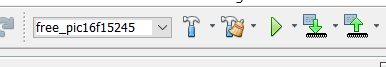

# MikroBus&trade; Demo PCB Assembly and Operating Instructions

This set of instructions is for building a demo version of the Advanced I/O Expander with a MikroBus&trade; header.

## Table of Contents

* [Development Tools](#development-tools)
* [Device Overview](#pcb-overview)
* [Assembling](#assembling)
  * [Soldering Difficulty](#soldering-difficulty)
  * [Bill of Materials (BOM)](#bill-of-materials)
  * [Assembly](#assembly)
  * [Programming](#microcontroller-circuit)
* [Demo Program](#demo-program)

## Development Tools

- MPLAB&reg; PICKIT&trade; 4 (PG164140)
- *(Recommended, for demo program only)* Curiosity Nano LPC for Demo
  -  with PIC16F15244 Microcontroller in a 20-pin DIP

## Device Overview

## Assembling

### Soldering Difficulty

This board is intermediate in soldering difficulty. The most difficult part to solder is the microcontroller, an SSOP-20 with a 0.65mm pin pitch. Discrete resistors and LEDs are 0805 size.

### Bill of Materials
Please consult the Bill of Materials (BOM) included in this folder for the full list of parts. We ordered the parts from Digikey Electronics, and the PCBs from OSH Park.

### Assembly

Note: The order of assembly is not critical to the functioning of the board, however it may make it harder to assemble or test as you go.

#### Microcontroller Circuit
1. U1 (PIC16F15244)
  - **Important: Check the device orientation before soldering!**
2. R1 (10k&Omega;)
3. C2 (10nF/10,000pF)
4. R2 (470&Omega;)
  - Located on the back of the board
5. C1 (0.1&micro;F)
  - Located on the back of the board

##### Microcontroller Testing (Optional)
You can verify the microcontroller is functioning correctly at this point. Connect the PICKIT 4 header to the J1, *but do not solder the header*. Configure the firmware (see Program Device section).

- Then, right click the project in MPLAB X IDE, and select project properties. Scroll through the configurations until you reach your active configuration (either `free_pic16f15244` or `pro_pic16f15244`, depending on your compiler license).

- Select the PICKIT 4 programmer and hit apply.

- Then, open PICKIT 4 properties -> Power.

- Check the box for `Power Target Circuit from PICKIT 4` and set the voltage level to the desired level for testing.

- Connect the PICKIT to the header (matching pin 1 to pin 1) and program the device.

**Important: If the board is being powered externally, then this option should not be used.**

If programming completes successfully, then the microcontroller is operating as expected.

If programming fails,
- Try holding the header in place (loose connection)
- Check soldering for bridges or open connections
- Verify the orientation of the microcontroller is correct
  - If oriented incorrectly, the microcontroller may have been damaged.

#### LED Assembly
Note: These parts are not labeled on the board - they are located at the very top of the board, as shown below.

1. Solder 1 side of the LEDs (D1 - D7)
  - **Note: Pin 7 of the I/O Expander is on the left of the board (near J2). If using a green-yellow-red pattern, red LEDs should go on the left, yellow in the middle, and green on the right.**
  - Since the polarity markers on the LEDs are hard to see, we recommend using a multimeter with a diode test mode to verify the cathode of the LEDs is towards the edge, and the anode is away from the edge.
  - This is also the best time to align the LEDs and get them flush with the circuit board.
2. Solder the other pad of the LEDs
3. Solder the resistors below the LEDs (R6 - R13, 1k&ohm;)
  - Changing this resistance will change the brightness of the LED

#### Reset, INT Pull-Up, and LED Switch

1. R5 (10k&ohm;)
 - Located on the back of the board
2. Q1 (2N7002)
  - Located on the back of the board
3. SW1
  - Located on the back of the board
4. Voltage Selector Switch (SW2, 0&ohm; jumper)
  - This a 0&ohm; jumper located just below U1. Either 3.3V or 5V can be selected.

#### Pin Headers
**Note: When soldering pin headers, solder 1 pin, then verify the header is straight and flush with the board. It's a lot harder to fix this type of issue once fully soldered.**

  1. J2
  2. J1
  3. MikroBus headers (MB1)
   - Ensure these headers are straight, or the board may not fit into the socket.

#### Reset Switch
  1. SW3

### Programming
Note: If the microcontroller was programmed during testing, then you may skip these instructions.

1. Download a copy of the Advanced I/O Expander Source Code and open the project in MPLAB X
2. In the file *config.h*, comment out the macro `#define ENABLE_ADDR_LINES` on line 32.
3. In MPLAB X, select either the `free_pic16f15244` or `pro_pic16f15244` configurations in the top dropdown. (If using a different device, then select the configuration as needed.)
 - If you have a pro XC8 compiler license, the pro configuration has been set to the highest level of optimization.
 - For free compiler users, the free configuration can be migrated up-to optimization level 2 (from 0) in the configuration settings.

4. Right click on the project, and open properties.
5. In the configuration, select the PICKIT4 programmer and press apply.

**Important: The board must be powered up to program the firmware. We recommend powering the board from a Curiosity Nano LPC or Curiosity Nano Adapter board. (Do NOT plug the board in while the host board is powered!) Alternatively, you can follow the directions in Microcontroller Testing to power the board from the PICKIT 4, however the board should NOT be plugged into a host board while doing this.**

6. With the board powered (we recommend plugging into a Curiosity LPC or Curiosity Nano Adapter Board), press the program button in MPLAB X.

## Demo Program

### Software

- MPLAB X IDE v5.50
- XC8 v2.32
- DFP (???)

### Pin Table

| Pin | Description
| --- | ----------
| RB4 | I2C SDA
| RB6 | I2C SCL
| RA2 | Open-Drain Interrupt (INT)
| RA4 | IO Expander Reset

### Description
