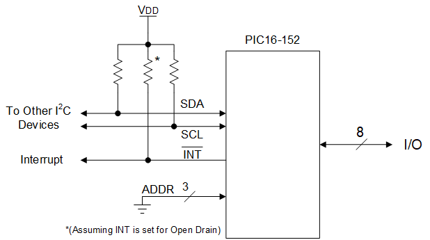
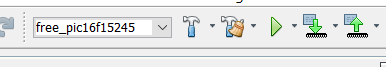
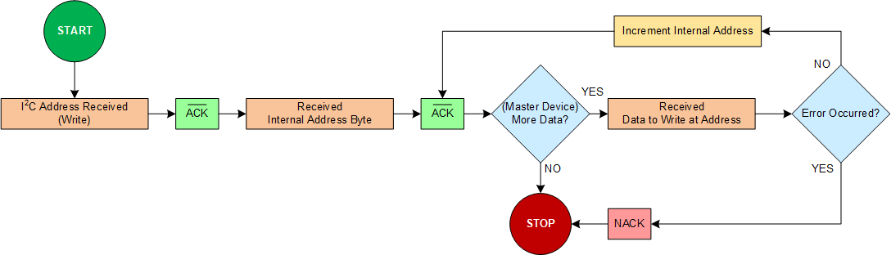
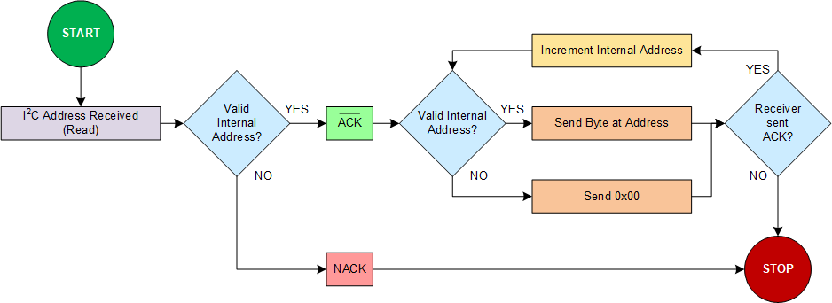
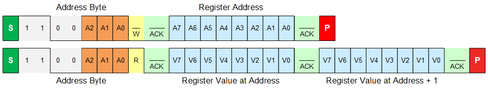
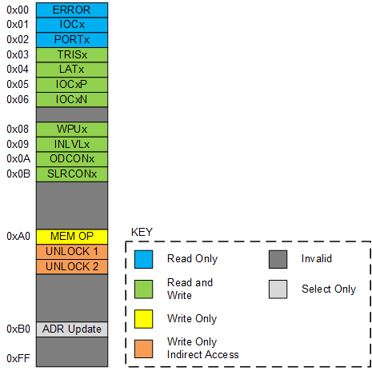
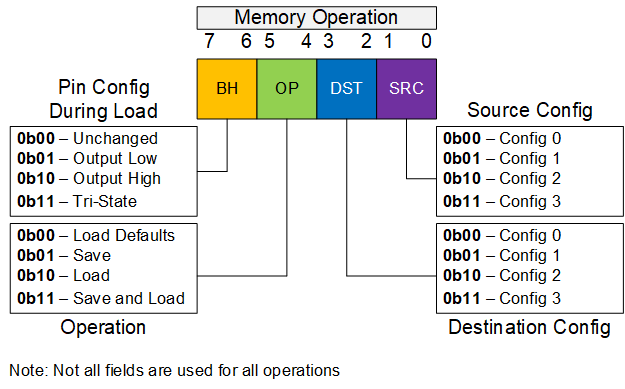
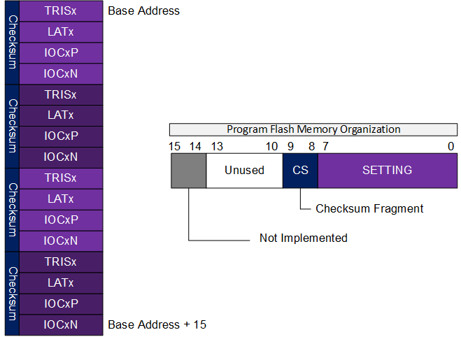

<!-- Please do not change this html logo with link -->

# Advanced I2C 8-Bit I/O Expander with PIC16F15244 Family
One of the biggest benefits of I2C is the simple wiring required to create a full-featured serial bus. This code example leverages this fact to create an advanced 8-bit I/O extender using the MSSP module, along with powerful other features such as Interrupt on Change (IOC) and the Program Flash Memory (PFM) to store and switch between different I/O configurations.

## Related Documentation

* <a href="https://onlinedocs.microchip.com/pr/GUID-632C0460-65B2-4F1E-8D1A-B760EB793F79-en-US-4/index.html">PIC16F15244 Family Datasheet (Web Version)</a>
* <a href="https://github.com/microchip-pic-avr-examples/pic16f15244-family-simple-i2c-io-expander">Code Example: Simple I/O Expander with the PIC16F15244 Family</a>
* <a href="https://microchip.com/design-centers/8-bit/peripherals/input-output">I/O Peripherals Information</a>

## Software Used

* <a href="http://www.microchip.com/mplab/mplab-x-ide?utm_source=github&utm_medium=text&utm_campaign=pic152xx&utm_content=MCU8_MMTCha_advancedI2C_IOExpander">MPLAB® IDE 5.40 or newer</a>
* <a href="https://www.microchip.com/mplab/compilers?utm_source=github&utm_medium=text&utm_campaign=pic152xx&utm_content=MCU8_MMTCha_advancedI2C_IOExpander">Microchip XC8 Compiler 2.20 or newer</a>
* <a href="https://packs.download.microchip.com/">PIC16F1xxxx_DFP v1.4.119</a>

## Hardware Used

### Common Components (Select 1 of the following)

* <a href="https://www.microchip.com/developmenttools/ProductDetails/PartNO/ADM00559?utm_source=github&utm_medium=text&utm_campaign=pic152xx&utm_content=MCU8_MMTCha_advancedI2C_IOExpander">MCP2221A USB-UART/I2C breakout module, PN: ADM00559</a>
* Arduino UNO
  * [Install the Communication Library](Arduino/)

*Alternatively, any I2C master can be used with this example, however it may require extra programming or setup steps.*

### With a 20-pin PIC16F15244 family device on a Curiosity LPC Board

* <a href="https://www.microchip.com/DevelopmentTools/ProductDetails/PartNO/DM164137?utm_source=github&utm_medium=text&utm_campaign=pic152xx&utm_content=MCU8_MMTCha_advancedI2C_IOExpander"> Microchip Low Pin Count Curiosity, Rev. 4. PN: DM164137</a>  

**Important:** Many of the RCx pins are connected to components (such as LEDs, touch buttons, or the on-board potentiometer). Removing the small surface-mount jumpers (located on the back of the board) will disconnect these elements from the circuit. Soldering a pin header to the nearby unpopulated header will allow 2x1 pin jumpers to selectively enable these elements in the future.

### With the Curiosity Nano (PIC16F15244 Device)

* <a href="https://www.microchip.com/developmenttools/ProductDetails/PartNO/EV09Z19A?utm_source=github&utm_medium=text&utm_campaign=pic152xx&utm_content=MCU8_MMTCha_advancedI2C_IOExpander"> Microchip Curiosity Nano, PN: EV09Z19A</a>

**Important:** The debugger UART TX trace may interfere with the I/O Expander in some cases. Cutting this trace (located on the underside of the Nano) will resolve the issue.

## Table of Contents

* [Setup](#setup)
  * [Wiring](#wiring)
  * [Solution Setup](#solution-setup)
  * [Default I2C Settings](#default-i2c-settings)
  * [Default Program Settings](#default-program-settings)
* [Operation](#operation)
  * [Startup](#startup)
* [I2C Configuration](#i2c-configuration)
* [I2C Communication](#i2c-communication)
  * [Writing to the Device](#writing-to-the-device)
  * [Reading from the Device](#reading-from-the-device)
  * [Register Ordering and Permissions](#register-ordering-and-permissions)
* [Memory Operations](#memory-operations)
    * [Setting up Memory Operations](#setting-up-memory-operations)
    * [Memory Operation Byte](#memory-operation-byte)
    * [Memory Commands](#memory-commands)
      * [Load Default](#load-default)
      * [Save Configuration](#save-configuration)
      * [Load Configuration](#load-configuration)
      * [Save and Load Configuration](#save-and-load-configuration)
    * [Memory Storage](#memory-storage)
* [Error Handling](#error-handling)
* [Summary](#summary)

 

## Setup

### Wiring
 
*Figure 1 - Electrical Configuration of device. Shown with Address Lines tied to GND.* 

The default positions for the pins and ports are:

| Function  | Pin or PORT
| --------- | ----
| SDA       | RB4
| SCL       | RB6
| INT       | RA4
| ADDR0     | RA0
| ADDR1     | RA1
| ADDR2     | RA2
| I/O       | PORTC

*Note: Non-I2C locations can be changed in config.h*

## Solution Setup

**PIC16F15243 Only: Due to a bug in the compiler, Storage Area Flash must be disabled in the configuration words, otherwise executable code will be placed in a non-executable section of memory.**

1. Change the build configuration to the appropriate configuration ending with the part in use (ex: PIC16F15245). 
  a. If you have a license to use the Pro compiler, select the PRO option to enable code optimizations. 
  b. Otherwise, select the FREE option for no optimizations. 

 

2. Run Build and Clean on the project. (Hammer + Broom on the toolbar).   

*Important: Run* **Build and Clean** *when the configuration is changed. The cleaning operation clears any old files which may cause compile errors.*

### Default I2C Settings

**Speed:** 100kHz 
**Base Address:** 0x60 

### Default Program Settings

| Setting           | Default Value | Description
| ----------------- | ------------  | --------
| MEM_START         | 0x1F80        | Location of where the configs are stored in PFM.
| I2C_BASE_ADDRESS  | 0x60          | Base address of I2C communication. The lower 3-bits should be clear to enable ADDR lines to function.
| ENABLE_ADDR_LINES | DEFINED       | When defined, the addressing lines are sampled to determine the lower 3-bits of the I2C address.
| CONFIG_ON_BOOT    | DEFINED       | Enables whether the device will attempt to load CONFIG 0 on startup. If not enabled, the device starts with the default settings.
| ENABLE_OPEN_DRAIN | DEFINED       | If defined, the INT line is an open drain line. A resistor is needed to pull-up the line to Vdd. If not defined, the line is push-pull.

### Default Pin Settings

| Setting           | Default Value | Description
| ----------------- | ------------  | --------
| DEFAULT_TRISx     | 0xFF          | Default value of TRIS on the I/O port.
| DEFAULT_LATx      | 0x00          | Default value in LAT on the I/O port.
| DEFAULT_WPUx      | 0xFF          | Default value of WPU on the I/O port.
| DEFAULT_INLVLx    | 0x00          | Default value of INLVL on the I/O port.
| DEFAULT_SLRCONx   | 0xFF          | Default value of SLRCON on the I/O port.
| DEFAULT_ODCONx    | 0x00          | Default value of ODCON on the I/O port.
| DEFAULT_IOCxP     | 0x00          | Default enables of rising edge interrupts on the I/O port.
| DEFAULT_IOCxN     | 0x00          | Default enables of falling edge interrupts on the I/O port.

## Operation

### Startup
The I2C I/O expander can be set to initialize in 2 states - a hardcoded default setup , or the program will attempt to load configuration 0, which is stored in PFM. If configuration 0 fails CRC validation, then the defaults are loaded. For more information about stored configurations, see [*Memory Operations*](#memory-operations). 

### I2C Configuration
This example uses a 7-bit I2C address, with it **defaulting to 0x60** and the ***lower 3-bits set by the address lines***. On startup, the lines are polled to determine which address to use. After startup, the command Address Update (0xB0) can be executed to poll and change the address based on the current logic levels on the address select lines.

### I2C Communication
For reference with this section, please consult [*Register Ordering and Permissions*](#register-ordering-and-permissions) to see the valid addresses and the allowed operations at each address.

#### Writing to the Device
After addressing the device, the device will always ACK. The 1st data byte sent is the internal address byte. In the case of a read (or select only command), this is the only byte sent. All successive bytes are written to the registers, eg: the 2nd data byte would be written to the register at address, and the 3rd going into the register at address + 1, etc. After each successfully written byte, the internal address counter increments. Figure 2 is a simple flowchart that shows how I2C writes are handled, while figure 3 shows an example write. 

 
*Figure 2 - I2C Write Flowchart* 

 
*Figure 3 - I2C Example Write* 

**Important! IF data is written to a non-writable location (Read Only, Invalid, or Select Only regions), then the device will NACK and set an error code in the ERROR register.**

#### Reading from the Device
To read from the device, normally 2 operations are required, a write then a read. The write operation sends only a single data byte to indicate the internal address of the read. The I2C bus is stopped, and the device is reselected. If the internal address is at a readable location, then the device will ACK. 

**Important! IF the address set in the device is invalid, the device will NACK and set an error code in ERROR.** 

Each byte read from the device is the value in the associated register. If the read was successful, then the address is incremented.

**Important! IF the address reaches an address where reads are not allowed (Invalid, Write Only, Write Only, or Select Only), then the device sets an error code in STATUS and returns only 0x00 until the end of the transaction. The address is not incremented.**

Figure 4 shows the way I2C reads occur in the device. Figure 5 shows a sequential read of 2 addresses next to each other.

 
*Figure 4 - I2C Read Flowchart* 

 
*Figure 5 - I2C Example Read* 

#### Register Ordering and Permissions
Figure 6 shows the lookup table of registers on the device and the associated permissions.  
 
*Figure 6 - Register Order and Allowed Operations* 

##### Permission Descriptions

| Permission                           | Description
|------------------------------------- | -------
| Read Only (RO)                       | Registers that only return a value and cannot be set directly, such as error codes.
| Read and Write (RW)                  | General purpose registers that can be written to and read from.
| Write Only (WO)                      | Internal registers where the data stored is only for the device.
| Write Only, Indirect Access (WO, ID) | Internal registers that cannot be directly selected. Access is available only by sequential writing.
| Invalid (IV)                         | Unimplemented addresses. Also used as padding to prevent inadvertent access to some addresses.
| Select Only (SO)                     | This address can be selected by the 1st address byte, but reads and writes to this location are invalid. Used as a special register.

##### Register Descriptions

| Register    | Address | Permission | Function
| ----------- | ------- | ---------- | ---------
| ERROR       | 0x00    | RO         | Returns the internal error code, if set. Cleared on read.
| IOCx        | 0x01    | RO         | Returns a bitfield indicating where an IOC event has occurred. Cleared on read.
| PORTx       | 0x02    | RO         | Returns the current digital value on the I/O. (For lines that are set as an output, then this is normally LATx.)
| TRISx       | 0x03    | RW         | Read/Writes the value of TRISx on the configured port.
| LATx        | 0x04    | RW         | Read/Writes the value of LATx on the configured port.
| IOCxP       | 0x05    | RW         | Sets (or returns) the enabled I/O lines that can detect a rising edge.
| IOCxN       | 0x06    | RW         | Sets (or returns) the enabled I/O lines that can detect a falling edge.
| WPUx        | 0x08    | RW         | Enables internal weak pull-up resistors for the I/O port.
| INLVLx      | 0x09    | RW         | Sets the input level threshold for I/O lines.
| ODCONx      | 0x0A    | RW         | Enables whether an I/O line is an open-drain output.
| SLRCONx     | 0x0B    | RW         | Controls whether or not the slew rate of the I/O lines is run at full-speed or at a reduced-speed. Reduced speed slew rates are beneficial for reducing crosstalk and other sources of electromagnetic noise.
| MEM OP      | 0xA0    | WO         | Sets the memory operation to execute on the next STOP condition. *See* [*Memory Operations*](#memory-operations) *for more details.*
| UNLOCK1     | N/A     | WO, ID     | Protection sequence to prevent accidental memory operations. Only accessed via sequential writes to MEM OP. **Write 0xA5**.
| UNLOCK2     | N/A     | WO, ID     | Protection sequence to prevent accidental memory operations. Only accessed via sequential writes to MEM OP. **Write 0xF0**, then STOP.
| ADR UPDATE  | 0xB0    | SO         | Updates the I2C address by repolling the address select lines. Select this register then STOP to update address.

## Memory Operations
This code example supports the ability to save and load I/O configurations to it's own internal PFM. 4 types of operations are supported:

1. Load Defaults
2. Save Configuration
3. Load Configuration
4. Save and Load Configuration

During memory operations, all interrupts are disabled and I2C will not be acknowledged.

### Setting up Memory Operations
For all memory operations, the following sequence must be followed:

 1. Select the address 0xA0
 2. Write the memory operation byte
 3. Write 0xA5
 4. Write 0xF0
 5. Stop the I2C bus
 6. Wait for INT to be asserted

 **Important! If I2C communication with the device is started during a memory write, the bus may become stuck due to the driver missing an interrupt. This is especially important if using the MCP2221A device, which cannot sense INT. In the I2C terminal, you must set a delay (100ms or more is recommended) to ensure enough time is given for the operation. The device can be recovered by pulling the MCLR (reset) line low.**

 When followed, the device will execute the programmed memory operation (clearing any previous errors and deasserting the INT line). When completed, the INT line is asserted and the internal address is moved to ERROR (0x00). A read operation can be run immediately following the memory write without the need to set the address.  

 **Important! If an error occurs in the I2C transmission immediately prior to the memory operation, then the operation will not occur. The INT line will still be asserted and the address selected will be set to ERROR (0x00).** 

If a memory operation fails, then the ERROR register will be updated and the memory operation will be terminated. The exact behavior on failure is defined for each operation in [*Memory Commands*](#memory-commands). 

### Memory Operation Byte

 
*Figure 7 - Memory Operation Byte* 

The formatting of the memory operation byte is shown in figure 7. Some configurations do not use some fields in the byte, as shown below. In this case, the unused fields can be set to any value.

| Operation     | Fields Used
| ------------- | ---------
| Load Defaults | OP
| Save          | DST, OP
| Load          | SRC, OP, BH
| Save and Load | SRC, DST, OP, BH

 

### Memory Commands

#### Load Defaults
This memory operation resets the current volatile settings to the defaults. 

**Fields Used:** OP 
**Failure Handling:** None. This routine invokes `void resetIO(void)` in io_control.h, which is a part of the compiled code, and is not modified at runtime. It is assumed this routine cannot fail. 

#### Save Configuration
This memory operation writes the current volatile I/O settings to the selected configuration DST.

**Fields Used:** DST, OP 
**Failure Handling:** The configuration that is written to memory is verified against the copy of the data in memory. If the values mismatch, an error is set. Loading mismatched memory should fail due to CRC checksum embedded with it. 

#### Load Configuration
This memory operation discards the current I/O settings and loads new settings from non-volatile memory. Prior to loading the configuration, the I/O pins can be set to remain in a specific state (defined by BH) until the operation has completed.

**Fields Used:** DST, OP, BH 
**Failure Handling:** When the memory is loaded, the CRC value is unpacked and used to verify the settings. If the CRC validation fails, then the pins will remain at the settings defined by BH, and an error will be set in ERROR. 

#### Save and Load Configuration
This memory operation saves the current volatile settings to DST, then loads new settings from SRC.

Note: This function does not validate that SRC and DST are different. Setting these to the same config will save and load to the same area in memory.

**Fields Used:** SRC, DST, OP, BH 
**Failure Handling:** Any failure in saving or loading will cause the pins to remain at BH. An error will be set in ERROR. 

### Memory Storage
In the PIC16F15244 family, the PFM is 14-bits wide. There are 8 fields that are saved, representing I/O direction (TRISx), output value (LATx), IOC settings (IOCxP and IOCxN), Weak Pull-Ups (WPUx), Input Level (INLVLx), Open Drain Control (ODCONx), and Slew Rate Control (SLRCONx). For loading the values, a simple CRC-8 checksum is calculated and packed in the high-byte, lower 2-bits of the top 4 settings as shown in Figure 8. When loading, this checksum is used to determine if the data is valid and uncorrupted. 

There are 4 configurations stored in memory, using 32 words (1 row) of memory. As a part of the writing process, the entire row is erased prior to writing. The save function caches the entire row before erase, applies any changes, then rewrites all of the row.

 
*Figure 8 - Memory Formatting and Packing* 

## Error Handling

| Error Code            | Value    | Description
| --------------------- | -------- | -----------
| ERROR_NONE            | 0x00     | No error has occurred. Default Condition.
| ERROR_READ_OVERRUN    | 0x01     | Attempted read at an invalid address, but started on a valid address.
| ERROR_WRITE_OVERRUN   | 0x02     | Attempted write at an invalid location, but started on a valid address.
| ERROR_INVALID_READ_OP | 0x03     | Attempted read at an invalid address.
| ERROR_INVALID_WRITE_OP| 0x04     | Attempted write at an invalid address.
| ERROR_UNUSED          | 0x05     | Not used currently.
| ERROR_INVALID_ACCESS  | 0x06     | Attempted to directly access UNLOCK1/2.  
| ERROR_ILLEGAL_MEM_OP  | 0x07     | A memory OP was set, but not properly unlocked.
| ERROR_MEM_OP_ABORTED  | 0x08     | `isValidMemoryUnlock()` detected an error was set after unlocking the device and aborted the memory OP.
| ERROR_MEM_INVALID_SEQ | 0x09     | An invalid sequence was provided to unlock the memory.
| ERROR_CRC_FAILED      | 0x0A     | The memory that was loaded did not match the CRC value.
| ERROR_WRITE_VERIFY    | 0x0B     | The memory written to the row does not match the internal copy of the data.

## Summary
This code example demonstrated using the PIC16F15244 family of devices to create a highly configurable I/O expander which can be used to create feature rich systems and designs easily. 
