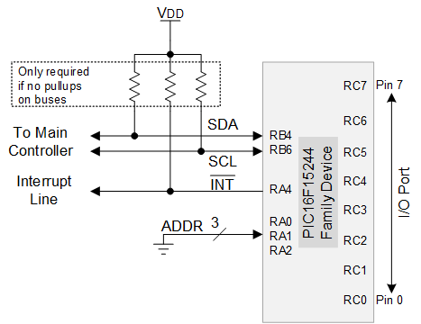

<!-- Please do not change this html logo with link -->

# I2C 8-Bit I/O Expander with PIC16F15245
One of the biggest benefits of I2C is the simple wiring required to create a full-featured serial bus. This code example leverages this fact to create an 8-bit I/O extender using the MSSP module, along with powerful other features such as Interrupt on Change (IOC) and the Program Flash Memory (PFM) to store and switch between different I/O configurations.

## Related Documentation

* <a href="https://www.microchip.com/wwwproducts/en/PIC16F15245">PIC16F15245 Documentation</a>

## Software Used

* <a href="http://www.microchip.com/mplab/mplab-x-ide">MPLAB® IDE 5.40 or newer</a>
* <a href="https://www.microchip.com/mplab/compilers">Microchip XC8 Compiler 2.20 or newer</a>

## Hardware Used

* <a href="">PIC16F15245, DIP</a>
* <a href="https://www.microchip.com/DevelopmentTools/ProductDetails/PartNO/DM164137"> Microchip Low Pin Count Curiosity, PN: DM164137</a>
* <a href="https://www.microchip.com/developmenttools/ProductDetails/PartNO/ADM00559"> I2C Master Device (or for easy testing, an MCP2221A USB-UART/I2C breakout module, PN: ADM00559)</a>

## Table of Contents

* [Memory Operation Byte](#memory-operation-byte)

## Setup

### Wiring
 
*Figure 1 - Electrical Configuration of device. Shown with Address Lines tied to GND.* 

On the PIC16-152, the default positions for the pins and ports are:

| Function  | Pin or PORT
| --------- | ----
| SDA       | RB4
| SCL       | RB6
| INT       | RB5
| ADDR0     | Rxy
| ADDR1     | Rxy
| ADDR2     | Rxy
| I/O       | PORTC

### Default I2C settings

**Speed:** 100kHz 
**Base Address:** 0x60 

## Operation

### Startup
The I2C I/O expander can be set to initialize in 2 states - a hardcoded default setup which sets all pins as inputs and disables all IOC functions, or configuration 0, which is stored in PFM. For more information about PFM configurations, see *Memory Operations*.  

### I2C Configuration
This example uses a 7-bit I2C address, with it defined **default 0x60** with the ***lower 3-bits set by the address lines***. On startup, the lines are polled to determine which address to use. After startup, the command Address Update (0xB0) can be executed to poll and change the address based on the current logic levels on the address lines.

### I2C Communication
For reference with this section, please consult *Command Ordering and Permissions* to see valid commands and the allowed operations associated.

#### Writing to the Device
After addressing the device, the device will always ACK. The 1st data byte sent is the starting address byte. In the case of a read (or select only command), this is the only byte sent. All successive bytes are passed to the commands as parameters, with the 2nd byte going into the command at the address, the 3rd going into the command at address + 1, etc. After each successful written byte, the internal address counter increments. The image in Figure 1 shows an example write to address and address + 1.  

**Important! IF data is written to a non-writable location (Read Only, Invalid, or Select Only regions), then the device will NACK and set an error code in the STATUS register.**

 
*Figure 2 - I2C Example Write* 

#### Reading from the Device
To read from the device, 2 I2C transactions must be executed, a write and a read. The write command sends only a single data byte to indicate the starting address of the read. The I2C bus is stopped, and the device is re-addressed. A valid read location will cause the device ACK on the bus. 

**Important! IF the address set in the device is invalid, the device will NACK and set an error code in STATUS.** 

Each successive byte after this is the returned value in each command register. On a successful read, the address is incremented.

**Important! IF the address enters a section of memory where reads are not allowed (Invalid, Write Only, Write Only, or Select Only), then the device sets an error code in STATUS and returns only 0x00 until the end of the transaction. The address is not incremented.**

Figure 2 (below) shows a sequential read of 2 addresses.

 
*Figure 3 - I2C Example Read* 

#### Command Ordering and Permissions
Figure 3 (below) shows the order of commands on the device and the associated permissions.  
 
*Figure 4 - Command Order and Allowed Operations* 

##### Permission Descriptions

| Permission                           | Description
|------------------------------------- | -------
| Read Only (RO)                       | Commands that only return a value and cannot be set directly, such as error codes.
| Read and Write (RW)                  | General purpose commands that can be written to and read from.
| Write Only (WO)                      | Internal commands where the data stored is only for the device.
| Write Only, Indirect Access (WO, ID) | Internal commands that cannot be directly selected. Access is available only by sequential writes.
| Invalid (IV)                         | Unimplemented command. Also used as padding to prevent inadvertent activation of some commands.
| Select Only (SO)                     | This address can be selected by the 1st address byte, but reads and writes to this location are invalid. Used as a special function.

##### Command Descriptions

| Command     | Address | Permission | Function
| ----------- | ------- | ---------- | ---------
| STATUS      | 0x00    | RO         | Returns the status of the device. Cleared on read.
| IOCx        | 0x01    | RO         | Returns where an IOC event has occurred. Cleared on read. Pins must have been set as IOC for this bit to be set.
| PORTx       | 0x02    | RO         | Returns the current digital value on the I/O. If set as an output, then the bit returned is the value of LATx.
| TRISx       | 0x03    | RW         | Read/Writes the value of TRISx on the configured port.
| LATx        | 0x04    | RW         | Read/Writes the value of LATx on the configured port.
| IOCxP       | 0x05    | RW         | Read/Writes the pin configuration for rising edges on PORTx.
| IOCxN       | 0x06    | RW         | Read/Writes the pin configuration for falling edges on PORTx.
| MEM OP      | 0xA0    | WO         | Sets the memory operation to execute on the next STOP condition. *See Memory Operations for more details.*
| UNLOCK1     | N/A     | WO, ID     | Protection sequence to prevent accidental memory operations. Only accessed via sequential writes to MEM OP. **Write 0xA5**.
| UNLOCK2     | N/A     | WO, ID     | Protection sequence to prevent accidental memory operations. Only accessed via sequential writes to MEM OP. **Write 0xF0**, then STOP.
| ADR UPDATE  | 0xB0    | SO         | Updates the I2C address by repolling the address select lines. Select this register then STOP to update address.

## Memory Operations
This code example supports the ability to save and load I/O configurations to it's own internal PFM. 4 types of operations are supported:

1. Load Defaults
2. Save Configuration
3. Load Configuration
4. Save and Load Configuration

During memory operations, all interrupts are disabled and I2C will not be acknowledged.

### Setting up Memory Operations
For all memory operations, the following sequence must be followed:

 1. Select the address 0xA0
 2. Write the memory operation byte
 3. Write 0xA5
 4. Write 0xF0
 5. Stop the I2C bus
 6. Wait for INT to be asserted

**Important! If the unlocking sequence is done incorrectly (wrong passed values), then the memory OP and INT assert will never occur. The device will continue to function.**  

 When followed, the device will execute the programmed memory operation (see Memory Operation Byte for details) and assert the INT line when it has completed. The address selected at the completion is STATUS (0x00). A read operation can be run immediately following the memory write without the need to set the address.  

 **Important! If an error occurs before the memory operation, then the operation will not occur. The INT line will still be asserted and the address selected will be set to STATUS (0x00).** 

If a memory operation fails, then the STATUS register will be updated and the operation will be terminated. The exact behavior is defined per operation.
 

### Memory Operation Byte

 
*Figure 5 - Memory Operation Byte* 

The formatting of the memory operation byte is shown in figure 4. Some configurations do not use some fields in the byte , as shown below. In this case, the unused fields can be set to any value.

| Operation     | Fields Used
| ------------- | ---------
| Load Defaults | OP
| Save          | DST, OP
| Load          | SRC, OP, BH
| Save and Load | SRC, DST, OP, BH

 

### Load Defaults
This memory operation resets the current volatile settings to the defaults. 

**Fields Used:** OP 
**Failure Handling:** None. This routine invokes `void resetIO(void)` in io_control.h, which is part of the compiled code, and is not modified at runtime. It is assumed this routine cannot fail. 

### Save Configuration
This memory operation writes the current volatile I/O settings to the selected configuration DST.

**Fields Used:** DST, OP 
**Failure Handling:** The configuration that is written to memory is verified against the copy of the data in memory. If the values mismatch, an error occurs in the program. Loading this mismatched memory will fail due to CRC checksum embedded with it. 

### Load Configuration
This memory operation discards the current I/O settings to load from non-volatile memory. Prior to loading the configuration, the I/O pins can be set to remain in a specific state (defined by BH) until the operation has completed.

**Fields Used:** DST, OP, BH 
**Failure Handling:** When the memory is loaded, the CRC value is unpacked and used to verify the settings. If the CRC fails, then the pins will remain at the settings defined by BH, and an error will be set in STATUS. 

### Save and Load Configuration
This memory operation saves the current volatile settings to DST, then loads new settings from SRC.

Note: This function does not validate that SRC and DST are different. Setting these to the same config will save and load to the same area in memory.

**Fields Used:** SRC, DST, OP, BH 
**Failure Handling:** Any failure in saving or loading will cause the pins to remain at BH. An error will be set in STATUS. 

### Memory Storage
On the PIC16-152, PFM is 14-bits wide. There are 4 fields that are saved, representing direction (TRISx), output value (LATx), and IOC (IOCxP and IOCxN). For loading the values, a simple CRC-8 checksum is calculated and packed in the high-byte, lower 2-bits of each word as shown in Figure 4. When loading, this checksum is used to determine if the data is valid and uncorrupted. 

There are 4 configurations possible, using 16 words worth of memory. As apart of the writing process, entire row (32 words) must be erased, however. The save functions cache the entire row before erase, apply changes, then rewrite all of the row. The unused words can be used to store or retrieve arbitrary values or constants in memory.  

 
*Figure 6 - Memory Formatting and Packing* 

## Error Handling

| Error Code            | Value    | Description
| --------------------- | -------- | -----------
| ERROR_NONE            | 0x00     | No error has occurred. Default Condition.
| ERROR_READ_OVERRUN    | 0x01     | Attempted read at an invalid address, but started on a valid address.
| ERROR_WRITE_OVERRUN   | 0x02     | Attempted write at an invalid location, but started on a valid address.
| ERROR_INVALID_READ_OP | 0x03     | Attempted read at an invalid address.
| ERROR_WRITE_ADDR      | 0x04     | Attempted write at an invalid address.
| ERROR_NON_ADDRESS     | 0x05     | Incorrect address received during I2C addressing, however interrupt triggered. Should never occur.
| ERROR_UNUSED          | 0x06     | Placeholder Error Code - to be replaced
| ERROR_ILLEGAL_MEM_OP  | 0x07     | `runMemoryOP()` was called even though `isPendingMemoryOP()` returned false.
| ERROR_MEM_OP_FAILED   | 0x08     | No error has occurred. Default Condition.
| ERROR_MEM_OP_ABORTED  | 0x09     | `isPendingMemoryOP()` detected an error was set after unlocking and aborted the memory OP.
| ERROR_MEM_INVALID_SEQ | 0x0A     | An invalid sequence was provided to unlock the memory.
| ERROR_INVALID_ACCESS  | 0x0B     | Attempted to directly access UNLOCK1/2.  

## Summary
The PIC16-152 is perfect for building intelligent and flexible I/O expanders that enable more feature rich systems that can do more with less.
